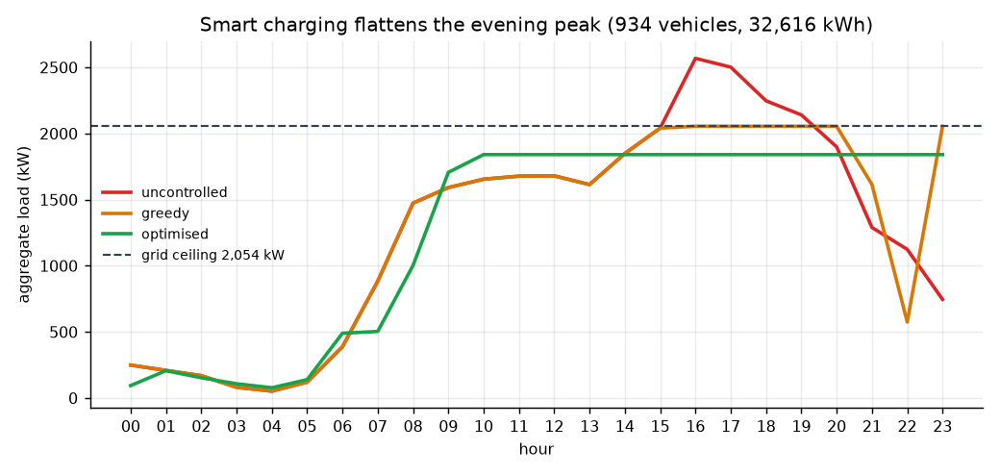
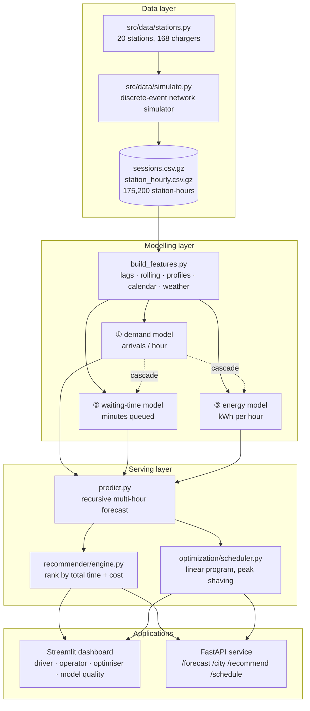
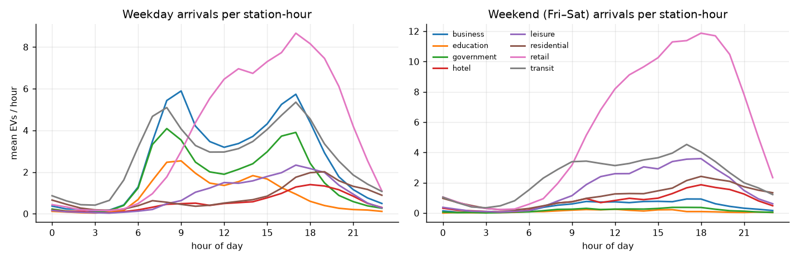
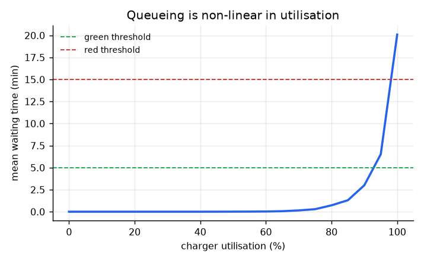
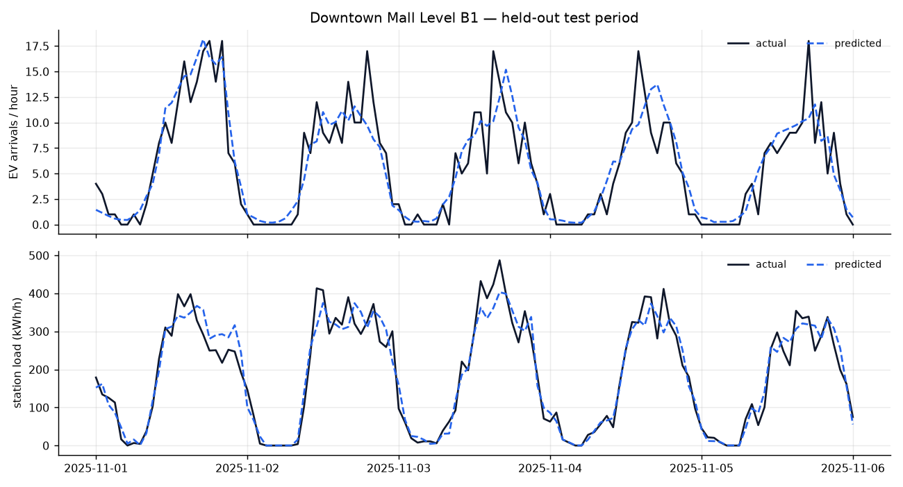
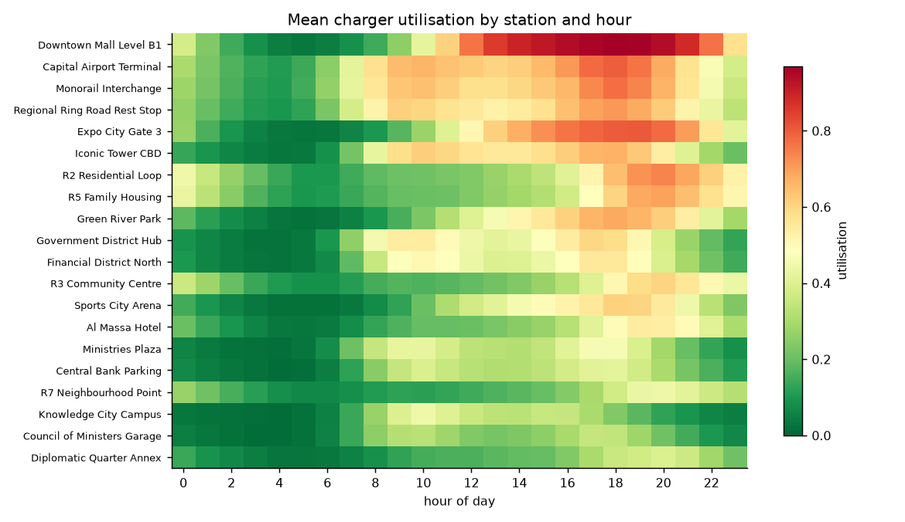

# ⚡ Smart EV Charging Prediction & Recommendation System

An AI system that manages a city-scale electric-vehicle charging network — built around
**Egypt's New Administrative Capital**, with 20 stations and 168 chargers.

It answers two very different questions with the same forecasting core:

| | Question | Answer it produces |
|---|---|---|
| 🚗 **Driver** | *Where should I charge, and how long will it take?* | Ranked stations by **total time** (drive + queue + charging), with predicted waiting time and cost |
| 🏙️ **City operator** | *What is the network going to do in the next 24 h?* | Expected EVs, expected grid load, congested stations, overload warnings — plus a charging schedule that flattens the peak |

The forecasting is machine learning. The decision of *how to spread the load* is a
**linear program**, not another regressor — that separation is deliberate and is
explained in [Why optimisation, not more ML](#why-optimisation-not-more-ml).

---

## What it does, concretely

**Driver side** — a car near Downtown at 18:00, battery at 22 %, wants 85 %:

```
Station                        km    drive   wait   charge   total   cost      status
Iconic Tower CBD             1.64      5.4    1.5     25.8    32.7   366 EGP   🟢 green
Financial District North     1.03      3.9    1.4     43.0    48.3   366 EGP   🟢 green
Government District Hub      1.34      4.7    2.2     43.0    49.9   366 EGP   🟢 green
Downtown Mall Level B1       1.06      4.0   21.3     43.0    68.3   366 EGP   🔴 red
Council of Ministers Garage  0.74      3.3    0.0    117.2   120.5   271 EGP   🟢 green

AI recommendation: Go to Iconic Tower CBD — predicted wait 2 min, ready by 18:32.
```

Note what the system did: it **rejected the two nearest stations**. The mall is 1 km away
but has a 21-minute predicted queue; the ministries garage has no queue at all but only
22 kW chargers, so it would take two hours. Neither distance nor availability alone gets
this right.

**Operator side** — 24-hour outlook with a grid ceiling, per-station congestion heatmap,
and the smart-charging plan:



| strategy | peak kW | peak ↓ | energy served on time | hours over the cap |
|---|---|---|---|---|
| uncontrolled | 2,568 | — | 92.7 % | **4** |
| greedy (least-laxity) | 2,054 | 20.0 % | 92.7 % | 0 |
| **LP optimised** | **1,840** | **28.3 %** | 92.7 % | 0 |

Same cars, same energy, same deadlines — 28 % less peak demand on the grid.

---

## Quick start

```bash
pip install -r requirements.txt
```

The dataset and trained models are committed, so you can go straight to the apps:

```bash
streamlit run app/dashboard.py
```

```bash
uvicorn app.api:app --reload
```

To rebuild everything from scratch (~4 minutes):

```bash
python -m scripts.run_all
```

Or step by step:

```bash
python -m src.data.simulate          # generate the historical dataset
python -m src.features.build_features
python -m src.models.train           # train + evaluate the three models
python -m tests.test_pipeline        # 40 invariant checks
```

---

## Architecture



---

## The dataset

There is no public charge-point dataset for the New Administrative Capital, so
`src/data/simulate.py` builds one: a **discrete-event simulator**, not random numbers.

- **20 stations** across the Government District, CBD, residential R-districts, Downtown,
  Expo City, the Capital Airport, the monorail interchange and the ring road — each with
  its own venue type, charger count and power rating.
- **Hourly arrival shapes per venue type.** Government and business sites peak at 08:00
  and 17:00; residential sites peak at 19:00; retail peaks on weekend afternoons.
  The weekend is **Friday–Saturday**, as in Egypt.
- **Poisson arrivals**, rate-scaled so an average-popularity station reaches ~68 %
  utilisation at its peak hour — busy sites overflow, quiet ones do not.
- **Per-session physics**: pack size, arrival state of charge, target SoC, vehicle power
  limit, constant-power phase then taper above 80 % SoC, plus a thermal penalty in cold
  and very hot weather.
- **An M/M/c queue per station** with FIFO service and **driver abandonment** — a driver
  facing a queue longer than their patience gives up and leaves (6.9 % of arrivals).
- **Realistic context**: Cairo-like temperature and rainfall, 17 Egyptian public holidays,
  ~47 venue events per year that double demand at one site for a few hours, and a +45 %
  EV-adoption trend across the year.

| | |
|---|---|
| period | 2025-01-01 → 2025-12-31, hourly |
| station-hours | 175,200 |
| charging sessions | 297,856 (20,644 abandoned) |
| energy delivered | 11,082 MWh |
| mean utilisation | 32.1 % (peak 100 %) |
| city peak load | 3,439 kW |



The structure the models have to learn is real: a double commuter peak on weekdays, a
completely different retail-led weekend, and a strongly non-linear relationship between
utilisation and queueing.



> Everything downstream of `data/raw/` works unchanged on real charge-point records with
> the same schema. Swapping in a real dataset means replacing one file.

---

## The models

Three `HistGradientBoostingRegressor` models, all one-hour-ahead:

| # | Target | Question | Features |
|---|---|---|---|
| ① | `arrivals` | How many EVs will plug in here next hour? | 51 |
| ② | `avg_wait_min` | How long will a driver queue? | 50 |
| ③ | `energy_kwh` | How much grid energy will this station draw? | 49 |

Features: calendar and cyclical encodings, weather, scheduled events, station capacity,
lags at 1/2/3/24/48/168 h, rolling means over 3/24/168 h, a leak-free **expanding**
(station × weekday × hour) demand profile, and city-wide network state.

### Results (held-out test set)

Validation is a **time split** — the last 2 months (29,280 unseen station-hours) are held
out. A random split would leak the future through the lag features.

| target | MAE | RMSE | R² | baseline MAE | improvement |
|---|---|---|---|---|---|
| `arrivals` | 0.980 | 1.505 | **0.746** | 1.290 *(same hour last week)* | **24.0 %** |
| `avg_wait_min` | 1.105 | 4.125 | **0.618** | 1.883 *(historical profile)* | **41.3 %** |
| `energy_kwh` | 14.52 | 23.48 | **0.927** | 34.30 *(same hour last week)* | **57.7 %** |

For the driver-facing traffic light (🟢 ≤ 5 min / 🟡 ≤ 15 min / 🔴 above):
**93.7 % of station-hours get the right colour**, and 93.0 % of predictions land within
5 minutes of the truth.



### Honest cascade evaluation

Models ② and ③ take `arrivals` as an input. In production that input is itself a
prediction, so the errors compound. The report scores **both** paths:

| target | R² with observed arrivals | R² with **predicted** arrivals |
|---|---|---|
| `avg_wait_min` | 0.618 | 0.506 |
| `energy_kwh` | 0.927 | 0.888 |

The end-to-end numbers are the ones that matter operationally, and they are the ones the
dashboard shows.

### Multi-hour forecasting

A one-hour-ahead model cannot answer *"what does 19:00 look like?"* at 14:00 — its lag
inputs do not exist yet. `src/models/predict.py` closes the loop with **recursive
forecasting**: walk forward one hour at a time, write each prediction back into the panel,
and use it as the lag for the next step.

---

## Why optimisation, not more ML

Once you know 30 cars will arrive between 17:00 and 19:00, deciding how to power them is
**not a prediction problem** — it is a constrained allocation problem with a known
objective. Modelling it as one is both more honest and more effective.

```
minimise   Σ price[t]·x[v,t]          energy bill under the time-of-use tariff
         + w · P_peak                 flatten the aggregate profile
         + 500 · Σ u[v]               energy not delivered before departure

s.t.  Σ_t x[v,t] + u[v] = E_v         every car gets what it asked for
      0 ≤ x[v,t] ≤ P_v                charger and vehicle power limits
      x[v,t] = 0 outside [arrival, departure]
      Σ_v x[v,t] ≤ cap[t]             feeder / grid ceiling
      Σ_v x[v,t] ≤ P_peak
```

Solved with HiGHS via `scipy.optimize.linprog`; a least-laxity-first greedy scheduler is
kept as a fallback and as a reference point. The unmet-energy slack variable means the
problem is **always feasible** — an infeasible grid ceiling shows up as unserved energy in
the report instead of a solver crash.

---

## API

```bash
uvicorn app.api:app --reload    # docs at http://127.0.0.1:8000/docs
```

| endpoint | purpose |
|---|---|
| `GET /health` | liveness, loaded models, end of the history window |
| `GET /stations` | the 20-station network |
| `GET /forecast?hours=24&station_id=ST12` | station-level forecast |
| `GET /city?hours=24` | operator view: load curve, headroom, stations to watch |
| `GET /schedule?hours=24&limit_kw=2000` | uncontrolled vs greedy vs optimised |
| `GET /metrics` | held-out accuracy of all three models |
| `POST /recommend` | driver view: ranked stations + one recommendation |

```bash
curl -X POST http://127.0.0.1:8000/recommend \
  -H "Content-Type: application/json" \
  -d '{"lat":29.9985,"lon":31.7318,"soc_now":0.18,"battery_kwh":75,"objective":"balanced"}'
```

---

## Dashboard

`streamlit run app/dashboard.py` — four tabs:

1. **🚗 Driver** — location, battery, departure time and objective (fastest / cheapest /
   balanced) → recommendation card, ranked comparison, and the predicted queue at every
   station hour by hour.
2. **🏙️ City operator** — KPIs, the load curve against the grid ceiling, a station × hour
   waiting-time heatmap, and a live network map colour-coded by service level.
3. **🔋 Smart charging** — the optimiser, with sliders for the grid ceiling and the
   peak-shaving weight so you can watch the trade-off against the energy bill.
4. **📈 Model quality** — held-out metrics, predicted-vs-actual traces, error
   distributions, and permutation feature importances.



---

## Project structure

```
src/
  config.py                  paths, tariff, grid limits, service levels
  data/
    stations.py              the 20-station network + geo helpers
    simulate.py              discrete-event simulator -> data/raw/
  features/
    build_features.py        leak-free feature engineering
  models/
    train.py                 training, time-split evaluation, reports
    predict.py               recursive multi-hour forecaster
  recommender/
    engine.py                driver-side ranking (time + cost + reachability)
  optimization/
    scheduler.py             LP peak shaving + greedy baseline
app/
  api.py                     FastAPI service
  dashboard.py               Streamlit front end
scripts/
  run_all.py                 one-command pipeline
  make_figures.py            report figures
tests/
  test_pipeline.py           40 invariant checks
artifacts/
  models/                    trained models (.joblib)
  reports/                   metrics.json, model_report.md, figures/
data/raw/                    the generated dataset
```

---

## Tests

```bash
python -m tests.test_pipeline
```

40 checks covering the failure modes that quietly ruin a forecasting project:

- **Simulator integrity** — `arrivals == served + abandoned`, abandoned sessions deliver
  no energy, hourly aggregation conserves session energy to within 3 %, and *a station
  never serves more cars at once than it has chargers* (this one caught a real bug: the
  queue timeline and the emitted timestamps used two different time representations,
  letting sessions overlap by up to 5 seconds).
- **No leakage** — every lag really is the previous value, the expanding profile never
  sees its own row, and no feature is a near-perfect copy of its target.
- **Forecast sanity** — no NaNs, no negative predictions, the horizon starts strictly
  after the history ends, city totals equal the sum over stations.
- **Recommender consistency** — total time is the sum of its parts, options are ranked by
  score, a faster charger never takes longer.
- **Optimiser correctness** — the hourly cap is respected, no car charges outside its
  parking window or above its power limit, and the peak drops *while the energy is still
  delivered* (otherwise "peak shaving" is just not charging the cars).

---

## نظرة عامة بالعربي

النظام ده بيدير شبكة شحن سيارات كهربائية على مستوى مدينة كاملة — 20 محطة و168 شاحن
في العاصمة الإدارية الجديدة.

فيه **ثلاث موديلات ML** بتتنبأ لكل محطة بالساعة الجاية:

1. **عدد السيارات** اللي هتوصل المحطة — دقة R² = 0.75
2. **وقت الانتظار** المتوقع — دقة إشارة المرور (🟢🟡🔴) = 93.7 %
3. **استهلاك الكهرباء** بالكيلوواط/ساعة — دقة R² = 0.93

وبعدين النظام بيستخدم التوقعات دي في حاجتين:

- **للسائق:** يرتّب المحطات القريبة حسب **إجمالي الوقت** (الوصول + الانتظار + الشحن) مش
  حسب المسافة بس. في المثال اللي فوق النظام **رفض أقرب محطتين** — واحدة عليها طابور
  21 دقيقة، والتانية شواحنها بطيئة (22 kW) وهتاخد ساعتين.
- **لمشغّل المدينة:** يتوقع الحمل على الشبكة، ويحذّر من الـpeak، وبعدين يوزّع قدرة الشحن
  بـ**Linear Programming** (مش ML) بحيث كل عربية تاخد الطاقة اللي محتاجاها قبل ما تمشي،
  ومع ذلك يقل الحمل الأقصى على الشبكة بنسبة **28 %**.

الفرق ده مقصود: التنبؤ شغل الـML، أما **قرار** توزيع القدرة فهو مسألة optimization
بقيود معروفة — وده أصح علميًا من إننا نسمي كل حاجة ML.

البيانات متولّدة بـ`src/data/simulate.py` (محاكاة أحداث حقيقية: طوابير، انصراف السائقين،
فيزياء الشحن، طقس، أجازات، مناسبات)، وكل الكود اللي بعد `data/raw/` بيشتغل زي ما هو على
بيانات حقيقية بنفس الأعمدة.

---

## Notes and limitations

- **The data is simulated.** The simulator is detailed and internally consistent, but it
  is still a model of the world, not the world. Accuracy figures describe how well the
  models recover the simulator's structure — they are not a claim about real NAC traffic.
- **Waiting time is modelled at hourly resolution.** A real deployment would use live
  charge-point occupancy (OCPP) for the current hour and the model only for the forecast.
- **The tariff is illustrative.** `config.TARIFF_EGP_PER_KWH` is a plausible time-of-use
  structure, not a published one.
- **The optimiser assumes departure times are known.** In practice they come from the
  driver's stated plan or from a learned dwell-time model per venue type.
